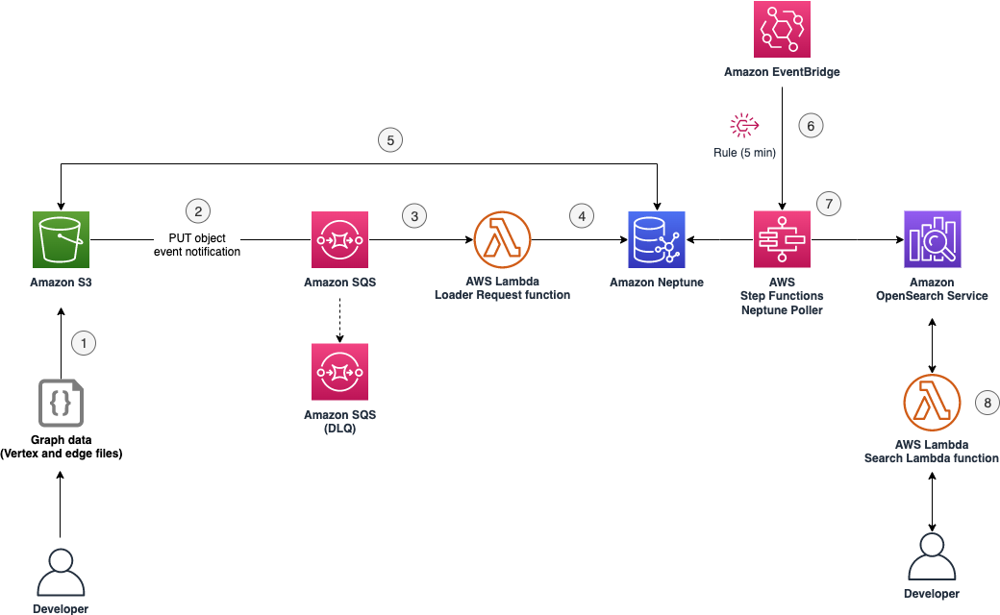

<!---
Copyright 2023 Amazon.com, Inc. or its affiliates. All Rights #Reserved.

This library is licensed under the MIT-0 License. See the LICENSE file.

or in the "license" file accompanying this file. This file is distributed on an "AS IS"
BASIS, WITHOUT WARRANTIES OR CONDITIONS OF ANY KIND, either express or implied. See the
License for the specific language governing permissions and limitations under the License.
--->

# neptune-fraud-detection-with-opensearch

This repository contains Terraform modules to create a solution where the user can upload graph data that gets automatically ingested into the Amazon Neptune graph database service and replicated into Amazon OpenSearch Service for analysis.

## Architecture



## Prerequisites
To implement this solution, you must have the following prerequisites:
- An [AWS account](https://portal.aws.amazon.com/billing/signup#/start/email) with local credentials configured. For more information, check the documentation on [configuration and credential file settings](https://docs.aws.amazon.com/cli/latest/userguide/cli-configure-files.html).
- The latest version of the [AWS Command Line Interface (AWS CLI)](https://docs.aws.amazon.com/cli/latest/userguide/getting-started-install.html).
- A Git client to clone the source code provided.
- A Bash shell.
- [Docker](https://docs.docker.com/get-docker/) installed on your localhost.
- [Terraform](https://developer.hashicorp.com/terraform/tutorials/aws-get-started/install-cli) installed on your localhost.

## Deploying the Terraform templates

1. Create a local directory called `NeptuneOpenSearchDemo` and clone the source code repository:

```bash
mkdir -p $HOME/NeptuneOpenSearchDemo/
cd $HOME/NeptuneOpenSearchDemo/
git clone https://github.com/aws-samples/neptune-fraud-detection-with-opensearch.git
```

2. Change directory into the Terraform directory:

```bash
cd $HOME/NeptuneOpenSearchDemo/neptune-fraud-detection-with-opensearch/terraform
```

3. Make sure the Docker daemon is running:

```bash
docker info
```

If the previous command outputs an error that is unable to connect to the Docker daemon, start Docker and run the command again.

4. Initialize the Terraform folder to install required providers:

```bash
terraform init
```

5. Preview the changes you are about to deploy:

```bash
terraform plan
```

The solution is deployed on `us-west-2` by default. The user can change this behavior by modifying the variable `region` in `variables.tf` file.

6. Deploy the AWS services:

```bash
terraform apply -auto-approve
```

> Note: Deployment will take around 30 minutes due to the time necessary to provision the Neptune and OpenSearch clusters.

7. To retrieve the name of the S3 bucket to upload data to:
```bash
aws s3 ls | grep "neptunestream-loader.*\d$"
```

8. Upload node data to the S3 bucket obtained in the previous step:
```bash
aws s3 cp $HOME/NeptuneOpenSearchDemo/neptune-fraud-detection-with-opensearch/data s3://neptunestream-loader-us-west-2-123456789012 --recursive
```
> Note: This is a sample dataset for demonstration purposes only created from the [IEEE-CIS Fraud Detection dataset](https://www.kaggle.com/c/ieee-fraud-detection/data).

## Test the solution

After the solution is deployed and the dataset is uploaded to S3, the dataset can be retrieved and explored through a Lambda function that sends a search request to the OpenSearch cluster.

1. Confirm the Lambda function that sends a request to OpenSearch was deployed correctly:

```bash
aws lambda get-function --function-name NeptuneStreamOpenSearchRequestLambda --query 'Configuration.[FunctionName, State]'
```

2. Invoke the Lambda function to see all records present in OpenSearch that are added from Neptune:

```bash
aws lambda invoke --function-name NeptuneStreamOpenSearchRequestLambda response.json
```

The results of the Lambda invocation are stored in the `response.json` file. This file contains the total number of records in the cluster and all records ingested up to that point. The solution stores records in the index `amazon_neptune`. An example of a node with device information looks like this:
```json
{
	"_index": "amazon_neptune",
    "_type": "_doc",
    "_id": "1fb6d4d2936d6f590dc615142a61059e",
    "_score": 1.0,
    "_source": {
        "entity_id": "d3",
        "document_type": "vertex",
        "entity_type": [
            "vertex"
        ],
        "predicates": {
            "deviceType": [
                {
                    "value": "desktop"
                }
            ],
            "deviceInfo": [
                {
                    "value": "Windows"
                }
            ]
        }
    }
}

```

>Note: If you don't see any records in the response, wait a a few seconds and try again as the data replication might still be in progress.

## Cleaning up

To avoid incurring future charges, clean up the resources deployed in the solution:

```bash
terraform destroy -auto-approve
```

The command will output information on resources being destroyed.

```bash
Destroy complete! Resources: 101 destroyed.
```
